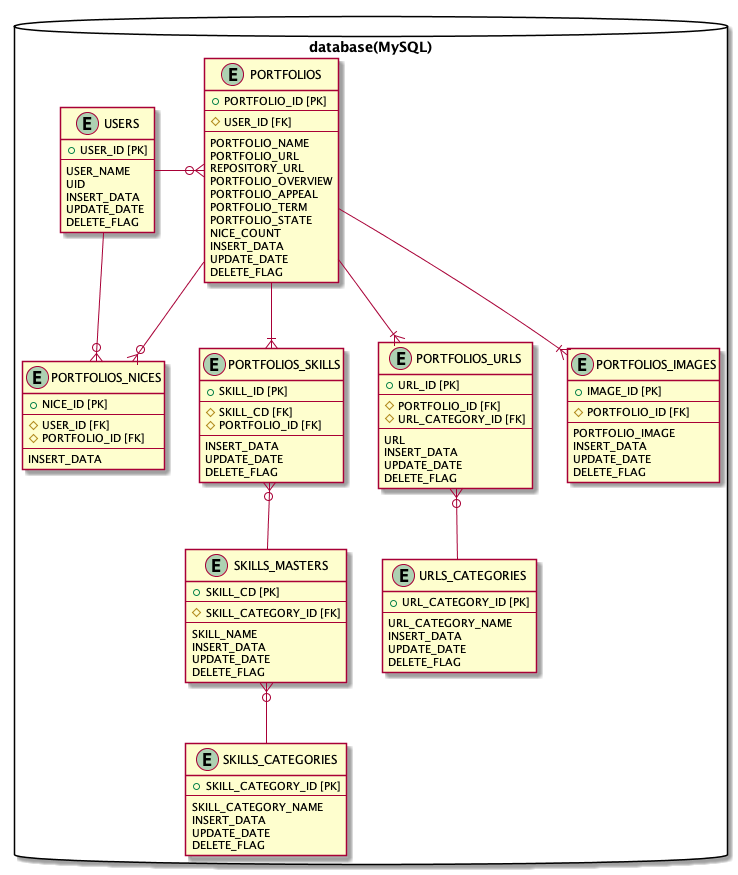

## 構成図について
構成図は、[PlantUML](http://plantuml.com/ja/)を使用して作成しています。
  
## 構成図の作成/修正手順
### 必要環境
- Homebrew
- VSCode

### PlantUMLのインストール
```bash
$ brew install graphviz
$ brew install plantuml
```

### VSCode に PlantUML のプラグインをインストール
- VSCodeを起動します
- Marketplace1 より、**PlantUML** をインストールしてください。

### PlantUMLのファイル作成/編集
- 拡張子 **.pu** のファイルを作成します。
- PlantUML記法で、puファイルを編集します。
- VSCode上で **[Alt] + [D]** でプレビュー画面が開きます.

### 画像出力
- 以下コマンドで、puフォルダと同じディレクトリにpngファイルが出力されます。
```bash
$ plantuml EntityRelationship.pu
```


