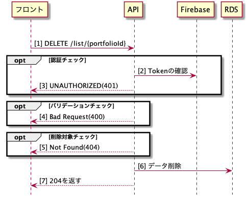

# Delete ListIdAPIの詳細設計書

## 概要
指定したポートフォリオIDの情報を論理削除するAPI

## シーケンス図

## API仕様書
http://localhost:8082/#/List/delete_list__portfolioId_

## ワークフロー
- 認証チェック
  - FirebaseにTokenを確認
  - Tokenエラーの場合は401を返す
- バリデーションチェック
  - 【型チェック】portfolioIdが数字でない場合は400を返す
- 削除対象チェック
  - portfolioIdとuserIdを条件として削除可能なportfolioがあるかを確認
    - 削除可能なportfolioがない場合は、404を返す
- 指定したportfolioを論理削除する
  - portfoliosテーブルのdelete_flagを1にする
- 204を返す
