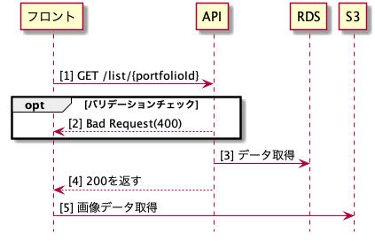

# Get ListIdAPIの詳細設計書

## 概要
ポートフォリオの詳細取得API

## シーケンス図

## API仕様書
http://localhost:8082/#/List/get_list__portfolioId_

## ワークフロー
- バリデーションチェック
  - 【型チェック】portfolioIdが数字出ない場合はエラー
- DBからデータ取得
- 200を返す
- フロントからS3にリクエストし、画像を取得