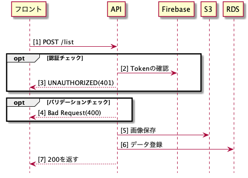

# Post ListAPIの詳細設計書

## 概要
ポートフォリオを新規登録するAPI

## シーケンス図

## API仕様書
`http://localhost:8082/#/List/post_list`

## ワークフロー
- 認証チェック
  - FirebaseにTokenを確認
  - Tokenエラーの場合は401を返す

- バリデーションチェック

    |      項目      | 必須 | 文字数  |
    | -------------- | ---- | ------- |
    | images         | ○    | ×       |
    | title          | ○    | <= 100  |
    | overview       | ○    | <= 500  |
    | detail         | ○    | <= 4000 |
    | skills         | ○    | ×       |
    | urls.github    | ○    | ×       |
    | urls.portfolio | ×    | ×       |
    | urls.blog      | ×    | ×       |
    | userAccount    | ○    | ×       |
    | userIcon       | ○    | ×       |
    | status.term    | ×    | <= 3    |
    | status.state   | ○    | ×       |

- S3に画像を保存
    - 保存先パス：pflist-img/portfolio/
    - ファイル名：{userAccount}_{UUID}

- リクエストの各項目の内容を、DBにInsert

- 200を返す
