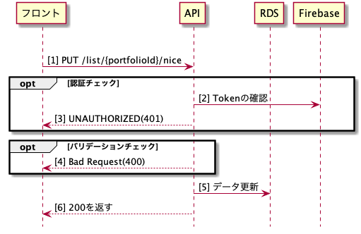

# Put ListIdNiceAPIの詳細設計書

## 概要
いいね情報を更新するAPI

## シーケンス図

## API仕様書
http://localhost:8082/#/List/put_list__portfolioId__nice

## ワークフロー
- 認証チェック
  - FirebaseにTokenを確認
  - Tokenエラーの場合は401を返す
- バリデーションチェック
  - 【型チェック】portfolioIdが数字出ない場合はエラー
- DBのデータ更新
  - PORTFOLIOS_NICEテーブルの更新
    - PORTFOLIOS_NICEにレコードがある場合は、deleteする
    - PORTFOLIOS_NICEにレコードがない場合は、insertする
  - PORTFOLIOSテーブルの更新
    - PORTFOLIOS_NICEにinsertした場合は、NICE_COUNTに1を加算する
    - PORTFOLIOS_NICEにdeleteした場合は、NICE_COUNTに1を減算する
- 200でレスポンスする
